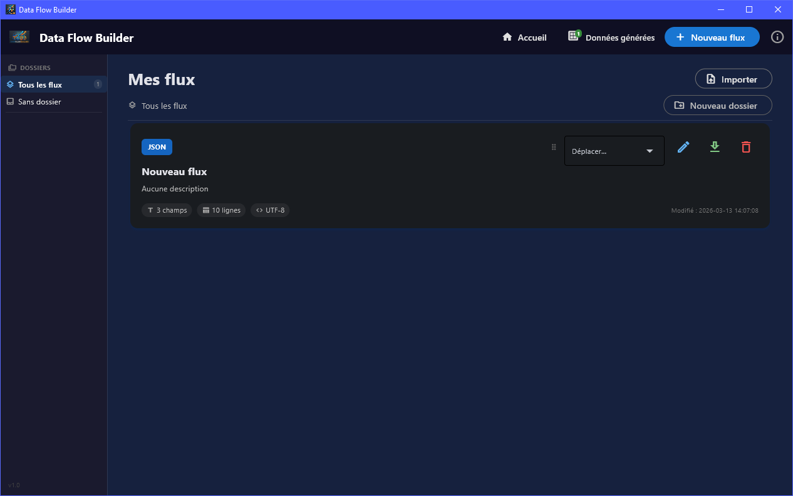

<div align="center">

<a href="https://github.com/creagleone/DataFlowBuilder/releases/latest">
  
</a>


<a href="https://github.com/creagleone/DataFlowBuilder/actions/workflows/ci.yml">
  
</a>


# 🗂️ Data Flow Builder

**Générez des fichiers de données de test réalistes en quelques clics**

Construisez des structures CSV, positionnelles, JSON ou XML avec des données françaises cohérentes (NIR, SIRET, IBAN, adresses géolocalisées…) — sans écrire une seule ligne de code.

[📦 Télécharger](https://github.com/creagleone/DataFlowBuilder/releases/latest) · [📖 Documentation](https://creagleone.github.io/DataFlowBuilder/#home) · [🐛 Signaler un bug](https://github.com/creagleone/DataFlowBuilder/issues/new?template=bug_report.yml) · [💡 Suggérer une fonctionnalité](https://github.com/creagleone/DataFlowBuilder/issues/new?template=feature_request.yml)

</div>

---

## 🖼️ Aperçu

<p align="center"></p>

---

## ✨ Pourquoi Data Flow Builder ?

| Besoin | Solution |
|---|---|
| Données de test réalistes pour vos tests | Faker FR + API officielle geo.api.gouv.fr |
| Fichiers fixes ou délimités sans coder | Éditeur graphique, aperçu instantané |
| NIR, SIRET, IBAN cohérents entre champs | Moteur de dépendances inter-champs |
| Partager des templates au sein d'une équipe | Import/Export JSON des flux |
| Organiser ses flux par projet ou client | Dossiers imbriqués, déplacement par menu |
| Générer et archiver plusieurs exports | Historique des fichiers générés par flux |
| Vérifier qu'un fichier réel respecte le mapping | Vérificateur de conformité intégré (encodage, types, formats, NIR, SIRET, IBAN…) |
| Utilisation sans installation Python | Binaire autonome Windows / macOS / Linux |

---

## Téléchargement

Aucun prérequis. Téléchargez l'archive correspondante à votre système sur la page [Releases](https://github.com/creagleone/DataFlowBuilder/releases/latest)

> ⚠️ **Windows :** lors du premier lancement, Windows SmartScreen peut afficher un avertissement *« Éditeur inconnu »* ou *« Application non reconnue »*. Cliquez sur **Informations complémentaires** puis **Exécuter quand même** pour continuer.  
> ⚠️ **macOS :** Gatekeeper peut bloquer l'application en indiquant que le développeur n'est pas identifié. Faites **clic droit → Ouvrir**, puis confirmez dans la boîte de dialogue pour contourner cette restriction.  
> ⚠️ **Linux :** rendez le fichier exécutable avec `chmod +x` avant de le lancer. Certains environnements de bureau peuvent afficher un avertissement similaire à la première exécution.


### Premier lancement

1. L'écran **Mes flux** s'affiche — vide au premier démarrage
2. Cliquez **+** dans la barre latérale pour créer un flux
3. Configurez le format, ajoutez des champs, cliquez **Aperçu**
4. **Sauvegarder** — le flux est conservé entre les sessions

> **Où sont stockées mes données ?** (Voir [Stockage des données](#stockage-des-données))

---

## Feuille de route 

[En construction]

---

## 📐 Concepts clés

### Flux (`Flow`)

Un **flux** est un template de fichier. Il définit :

- Le **format** de sortie : `csv`, `fixed` (positionnel), `xml`, `json`
- Le **délimiteur** (CSV), l'**encodage**, le **saut de ligne**, le délimiteur de fin de ligne optionnel
- Le nombre de **lignes** à générer
- Trois sections : **En-tête** · **Données** · **Pied de page**

### Sections et lignes de données

La section **Données** supporte plusieurs **structures de lignes** (multi-lignes). Chaque structure est répétée `numRows` fois, permettant de modéliser des fichiers avec plusieurs types d'enregistrements imbriqués.

```
[En-tête]       ← 1 fois
[Ligne A]  ×N   ← répétée numRows fois
[Ligne B]  ×N
[Pied de page]  ← 1 fois
```

### Champs (`Field`)

Chaque ligne est composée de **champs**. Un champ a un **type de base** et un **sous-type** :

| Type de base | Exemples de sous-types |
|---|---|
| `alpha` | `email`, `nom`, `prenom`, `adresse`, `civilite`, `iban`, `concat`… |
| `num` | `nir`, `siret`, `codePostal`, `codeInsee`, `compteurLignes`… |
| `date` | `dateNaissance`, format libre |
| `bool` | `O/N`, `OUI/NON`, `OK/KO`, `0/1` |
| `decimal` | Montants avec séparateur et décimales configurables |

### Presets

Chaque champ peut avoir une liste de **valeurs prédéfinies** — le générateur y pioche aléatoirement. Pour une distribution pondérée (ex. 70% ACTIF / 30% INACTIF), dupliquez simplement les entrées dans les proportions souhaitées.

### Dossiers

Les flux sont organisés en **arborescence de dossiers** (sous-dossiers supportés). Utilisez le menu contextuel pour créer, renommer, déplacer ou supprimer des dossiers.

> La suppression d'un dossier est irréversible. Les flux qu'il contient sont déplacés à la racine — pas supprimés.

---

## ✅ Vérification de conformité

Data Flow Builder intègre un **vérificateur de conformité** permettant de contrôler qu'un fichier de données réel respecte le mapping d'un flux.

### Accès

Ouvrez un flux dans l'éditeur, puis cliquez sur le bouton **Vérifier la conformité** (icône ✅) dans la barre d'actions.

### Contrôles effectués

| Contrôle | Formats |
|---|---|
| Encodage du fichier (détection automatique si incohérent) | Tous |
| Structure syntaxique (JSON valide, XML valide) | JSON · XML |
| Fins de ligne (`CRLF` / `LF`) | CSV · Positionnel |
| Présence du délimiteur déclaré | CSV |
| Nombre de champs par ligne vs mapping | CSV · Positionnel |
| Longueur de chaque champ vs longueur déclarée | CSV · Positionnel |
| Cohérence de type (`num`, `decimal`, `bool`, `date`) | CSV · Positionnel |
| Format de date exact | CSV · Positionnel |
| Cohérence du sous-type (`email`, `SIRET` + Luhn, `NIR`, `IBAN`, `codePostal`…) | CSV · Positionnel |

### Niveaux de sévérité

| Niveau | Signification |
|---|---|
| ❌ `error` | Écart bloquant — le fichier n'est pas conforme |
| ⚠️ `warning` | Anomalie probable (faux positifs possibles, ex. Luhn SIRET fictif) |
| ℹ️ `info` | Contrôle réussi |

Le rapport est **CONFORME** uniquement en l'absence d'erreurs. Les avertissements n'empêchent pas la conformité.

> **Limite** : le détail par champ est analysé sur les **1 000 premières lignes** au maximum.

### Export

Le dialogue propose un bouton **Exporter le rapport** qui sauvegarde un fichier `conformite_<nom_flux>.txt` avec le bilan complet (verdict, compteurs, durée, détail des écarts avec localisation ligne/champ).

---

### Alpha (texte)

| Sous-type | Description | Longueur défaut |
|---|---|---|
| `none` | Texte libre (ou valeur fixe via valeur par défaut) | 10 |
| `email` | Adresse e-mail réaliste | 50 |
| `phone` | Numéro FR (`0X XX XX XX XX`) | 14 |
| `phonePlus33` | Numéro FR international (`+33 X XX XX XX XX`) | 15 |
| `nom` | Nom de famille français | 30 |
| `prenom` | Prénom français | 30 |
| `prenomNir` | Prénom cohérent avec le NIR de la ligne *(lien configurable)* | 30 |
| `civilite` | Civilité — catégorie et format de sortie configurables | 10 |
| `civiliteNir` | Civilité cohérente avec le NIR *(lien configurable)* | 10 |
| `adresse` | Numéro et rue | 100 |
| `adresseComplete` | Adresse complète sur une ligne *(liable à un `codePostal`)* | 200 |
| `ville` | Commune française *(filtrable par code postal, liable à un `codePostal`)* | 50 |
| `pays` | Pays | 30 |
| `lieuNaissance` | Commune de naissance cohérente avec le NIR | 30 |
| `codeApe` | Code APE/NAF (ex : `6201Z`) | 5 |
| `iban` | IBAN français (`FR76 XXXX XXXX XXXX XXXX XXXX XXX`) | 27 |
| `concat` | Concaténation de champs et textes libres (éditeur dédié avec boutons ↑ ↓) | 50 |

### Num (numérique)

| Sous-type | Description | Longueur défaut |
|---|---|---|
| `none` | Entier libre (incrément optionnel, padding configurable) | 10 |
| `nir` | Numéro de sécurité sociale 15 chiffres | 15 |
| `siret` | SIRET 14 chiffres (SIREN + NIC) | 14 |
| `codePostal` | Code postal FR *(filtrable par préfixe, ex. `31*`)* | 5 |
| `codeInsee` | Code INSEE commune *(filtrable par préfixe)* | 5 |
| `departement` | Numéro de département (01–95) | 2 |
| `departementNaissance` | Département extrait du NIR *(lien configurable)* | 2 |
| `compteurLignes` | Nombre total de lignes du fichier calculé avant génération | 10 |

### Date

| Sous-type | Formats disponibles |
|---|---|
| `none` | `DD/MM/YYYY` · `YYYY-MM-DD` · `DD-MM-YYYY` · `MM/DD/YYYY` · `YYYYMMDD` · `DDMMYYYY` · `timestamp` · `YYYYMMDDHHmmss` · `DD/MM/YYYY HH:mm:ss` |
| `dateNaissance` | Idem, date cohérente avec l'année et le mois du NIR |

Options : **date du jour**, **borne min/max** (valeur fixe ou dynamique = aujourd'hui), **exclusif/inclusif**.

### Bool (booléen)

| Sous-type | Valeurs | Longueur |
|---|---|---|
| `none` | Aléatoire parmi les valeurs du preset (valeur par défaut configurable) | 3 |
| `ON` | `O` / `N` | 1 |
| `OUINON` | `OUI` / `NON` | 3 |
| `OKKO` | `OK` / `KO` | 2 |
| `BINAIRE` | `0` / `1` | 1 |

### Decimal

Montant décimal avec séparateur (`.` ou `,`) et nombre de décimales configurable (0–10). Supporte le padding.

---

## 🔗 Cohérence NIR

Data Flow Builder gère automatiquement la **cohérence entre champs liés au NIR** sur une même ligne. Ajoutez un champ `num/nir` et les champs suivants en seront automatiquement dérivés :

| Champ dépendant | Logique |
|---|---|
| `alpha/prenomNir` | Prénom masculin si NIR `1…`, féminin si `2…` |
| `alpha/civiliteNir` | `M`/`Monsieur` ou `Mme`/`Madame` selon le sexe |
| `date/dateNaissance` | Année et mois extraits du NIR, jour aléatoire 1–28 |
| `num/departementNaissance` | Positions 5-6 du NIR directement |
| `alpha/lieuNaissance` | Commune aléatoire du département extrait |

**Structure d'un NIR :**
```
185046912345678
│ ││ ││ ││  │└─── Clé          (positions 13-14)
│ ││ ││ │└──────── Ordre        (positions 10-12)
│ ││ ││ └───────── Commune      (positions 7-9)
│ ││ │└──────────── Département  (positions 5-6)  → 69 = Rhône
│ ││ └────────────── Mois        (positions 3-4)  → 04 = Avril
│ │└──────────────── Année       (positions 1-2)  → 85 → 1985
│ └────────────────── Sexe       (position 0)     → 1 = Masculin
```

### Contrôle des liaisons

Chaque champ dépendant expose un paramètre **Lien de cohérence** (`linkedFieldId`) :

| Valeur | Comportement | Cas d'usage |
|---|---|---|
| `""` | **Auto** — se lie au premier champ source trouvé dans la ligne | Standard, un seul NIR dans la ligne |
| `"__none__"` | **Indépendant** — génère sans tenir compte des autres champs | Champ entièrement libre |
| `"<id>"` | **Lié** — se synchronise avec le champ dont l'ID est `<id>` | Plusieurs NIR sur la même ligne |

La même logique s'applique aux champs géographiques (`ville` ↔ `codePostal`).

---

## 🌍 API Géographique

Les communes françaises sont chargées depuis **[geo.api.gouv.fr](https://geo.api.gouv.fr)** :

- **Cache local** JSON pour les usages offline ou répétés
- **Fallback** sur 10 grandes villes si l'API est inaccessible au premier lancement
- **Filtrage par préfixe de code postal** — exemples : `31*` (Haute-Garonne), `75*` (Paris), `*` (toutes les communes)

> Si l'application génère toujours les mêmes 10 villes, l'API était inaccessible au premier lancement. Vérifiez la connexion, supprimez `{appdir}/data/communes_cache.json` et redémarrez.

---

## ⚙️ Configuration d'un champ — Paramètres JSON

```jsonc
{
  "id": "abc123",               // Identifiant unique (auto-généré)
  "name": "Code client",        // Libellé affiché
  "category": "Identification", // Catégorie libre (groupement visuel)
  "type": "num",                // Type de base : alpha | num | date | bool | decimal
  "subType": "none",            // Sous-type (voir tableaux ci-dessus)
  "length": 8,                  // Longueur max de la valeur générée
  "includeInOutput": true,      // false → champ calculé non inclus dans le fichier

  // Padding (alpha/none, num/none, decimal)
  "padding": "before",          // none | before | after | both
  "paddingChar": "0",           // Caractère de remplissage (défaut : espace)

  // Valeur par défaut / valeur fixe
  "defaultValue": "CLIENT",

  // Incrément (num/none uniquement)
  "increment": true,
  "incrementStart": 1000,

  // Date
  "format": "DD/MM/YYYY",
  "todayDate": false,           // Générer toujours la date du jour
  "dateMinEnabled": true,
  "dateMinToday": false,
  "dateMinExclusive": false,
  "dateMin": "01/01/2020",
  "dateMaxEnabled": true,
  "dateMaxToday": true,         // Borne max dynamique = date d'exécution
  "dateMaxExclusive": false,
  "dateMax": "",

  // Concaténation (alpha/concat)
  "concatItems": [
    { "type": "field", "fieldId": "abc123" },
    { "type": "text",  "value": "_" },
    { "type": "field", "fieldId": "def456" }
  ],

  // Filtre géographique (codePostal, codeInsee, ville)
  // Wildcards : "31*" = commence par 31, "*" = tous, "33000" = exact
  "codePostalFilter": "31*",

  // Lien de cohérence (champs NIR et géographiques dépendants)
  // "" = auto | "__none__" = indépendant | "<id>" = lié à un champ précis
  "linkedFieldId": "",

  // Civilité
  "civiliteCategorie": "classiques",  // classiques | administratives | professionnelles
  "civiliteOutput": "code",           // code (M, Mme) | label (Monsieur, Madame)

  // Décimal
  "decimalSeparator": ",",      // . ou ,
  "decimalPlaces": 2,

  "comment": "Remarque interne"
}
```

---

## 📦 Format JSON d'un flux exporté

```jsonc
{
  "id": "1712345678.123",
  "name": "Flux salarié",
  "description": "Fichier mensuel RH",
  "format": "csv",              // csv | fixed | json | xml
  "delimiter": ";",
  "lineEnding": "CRLF",         // CRLF | LF
  "encoding": "UTF-8",
  "hasHeader": true,
  "numRows": 500,
  "trailingDelimiter": false,   // Ajouter le délimiteur en fin de chaque ligne
  "folderId": "1712000000.0",   // null si pas de dossier
  "created": "2024-04-05 10:00:00",
  "updated": "2024-04-06 14:30:00",

  "headerFields": [ /* tableau de champs */ ],
  "fields": [
    {
      "id": "ligne-1",
      "name": "Ligne données",
      "fields": [ /* tableau de champs */ ]
    }
  ],
  "footerFields": [ /* tableau de champs */ ],

  "presets": {
    "field-id": {
      "useRandom": false,
      "values": [
        { "value": "ACTIF",   "comment": "Salarié actif",   "isDefault": true  },
        { "value": "INACTIF", "comment": "Salarié inactif", "isDefault": false }
      ]
    }
  }
}
```

---

## Stockage des Données

```
{tempdir}/DataFlowBuilder/
├── flows/                      # Un fichier JSON par flux
│   └── flow_1234567890.json
├── data/
│   ├── folders.json            # Arborescence des dossiers
│   └── communes_cache.json     # Cache API géographique
├── generated/                  # Fichiers exportés (un sous-dossier par flux)
│   └── nom_du_flux/
│       └── export_2024-01-15.csv
├── assets/                     # Ressources applicatives (icône)
└── logs/
    └── dataflow_builder.log
```

---

## 🤝 Contribuer

1. **Forkez** le dépôt
2. Créez une branche : `git checkout -b feat/ma-fonctionnalite`
3. Commitez en *Conventional Commits* : `git commit -m 'feat: description'`
4. Pushez et ouvrez une **Pull Request** → utilisez le [template fourni](.github/pull_request_template.md)

Consultez les [issues ouvertes](https://github.com/creagleone/DataFlowBuilder/issues) pour trouver où contribuer.

---

## 📄 Licence

Distribué sous licence **Polyform_NC_1.0.0**. Voir [`LICENSE`](LICENSE) pour les détails.

---

<div align="center">

Fait avec ❤️ - [Signaler un problème](https://github.com/creagleone/DataFlowBuilder/issues)

</div>